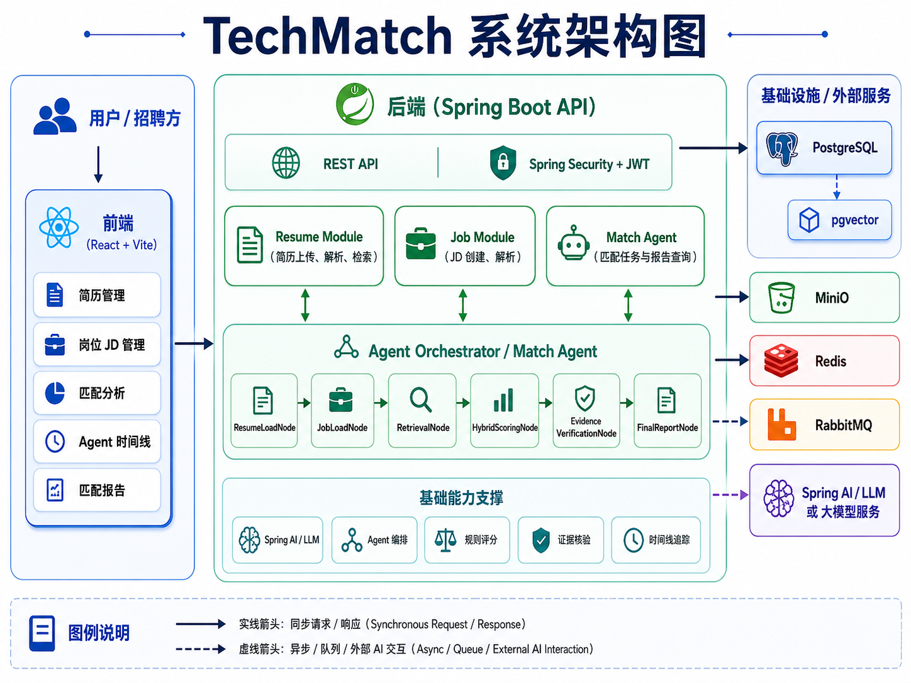
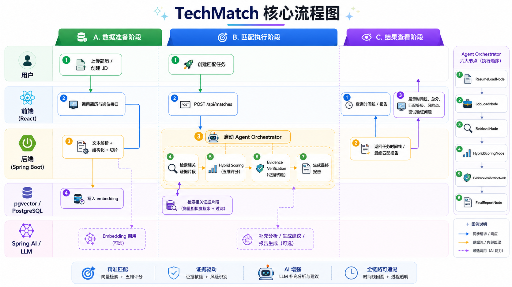

# TechMatch

> 基于 Spring Boot + Spring AI 的技术岗位人岗匹配与面试风险评估系统

[](https://adoptium.net/)
[](https://spring.io/projects/spring-boot)
[](./frontend)
[](https://github.com/pgvector/pgvector)

TechMatch 面向技术招聘场景，帮助招聘方完成从简历解析、岗位描述结构化、证据检索、规则评分，到 Agent 时间线追踪和最终匹配报告生成的一整条链路。

项目核心目标不是只给一个“分数”，而是给出：

- 可解释的匹配结论
- 可追溯的证据来源
- 可核验的风险点
- 可落地的面试验证问题

---

## 项目亮点

- `Resume Parsing`：支持 PDF / DOCX 简历上传、文本抽取、结构化解析
- `JD Parsing`：支持岗位描述结构化提取和切片入库
- `pgvector Retrieval`：使用 PostgreSQL + pgvector 存储 embedding，并进行相似度检索
- `Agent Orchestrator`：匹配任务创建后自动执行多节点工作流
- `Hybrid Scoring`：五维度规则评分，不完全依赖 LLM
- `Evidence Verification`：过滤无证据结论，降低幻觉
- `Agent Timeline`：记录每个节点的执行状态、耗时、重试与输出摘要
- `Frontend Demo`：提供可联调的 React 前端界面

---

## 功能全景

### 当前已完成

- 用户注册 / 登录 / JWT 鉴权
- 简历上传、MinIO 存储、PDF/DOCX 解析
- 简历结构化、切片、embedding、pgvector 检索
- JD 创建、结构化、切片、embedding
- 匹配任务创建、任务状态查询、时间线查询
- Agent 编排执行
- Hybrid Scoring 五维评分
- Evidence Verification 证据核验
- 最终报告查询接口
- 前端 `匹配分析 / 时间线 / 报告` 三页真实联调

### 进行中 / 待扩展

- Evidence Graph 图谱查询
- 面试反馈回流
- 报告持久化拆表
- 更完整的评分类与图谱节点模型

---

## 系统架构



---

## 核心流程



---

## 前端界面体现

### 1. 简历管理

- 上传 PDF / DOCX 简历
- 查看结构化简历内容
- 查看 chunk 切片和检索结果

### 2. 岗位 JD

- 创建岗位描述
- 查看结构化字段、职责、技能要求

### 3. 匹配分析

- 选择真实简历与真实 JD
- 一键创建匹配任务
- 自动触发后端 Agent 工作流

### 4. Agent 时间线

- 查看每个节点的执行顺序
- 查看执行状态、耗时、重试次数
- 查看输入摘要、输出摘要、元数据

### 5. 匹配报告

- 查看总分、匹配等级、置信度
- 查看五个维度评分
- 查看已核验优势、风险点、建议
- 查看由风险点自动生成的面试验证问题

---

## 项目结构

```text
.
├── src/main/java/com/techmatch
│   ├── auth          # 用户认证
│   ├── resume        # 简历上传、解析、检索
│   ├── job           # JD 创建、解析
│   ├── task          # AgentTask / Timeline
│   ├── match         # 匹配任务与报告查询
│   ├── agent         # Agent 编排与节点
│   ├── scoring       # Hybrid Scoring
│   ├── system        # 系统状态接口
│   └── common        # 通用响应、异常、错误码
├── src/main/resources
│   ├── application.yml
│   └── schema.sql
├── frontend          # React + Vite 前端
├── docker-compose.yml
└── docs
```

---

## 技术栈

### Backend

- Java 17
- Spring Boot 3.4
- Spring Security + JWT
- MyBatis-Plus
- PostgreSQL
- pgvector
- Redis
- RabbitMQ
- MinIO
- Spring AI
- SpringDoc OpenAPI

### Frontend

- React
- TypeScript
- Vite

---

## 快速开始

### 1. 启动依赖服务

在项目根目录执行：

```bash
docker compose up -d
```

默认会启动：

- PostgreSQL: `localhost:5432`
- Redis: `localhost:6379`
- RabbitMQ: `localhost:5672`
- RabbitMQ Console: `localhost:15672`
- MinIO API: `localhost:9000`
- MinIO Console: `localhost:9001`

---

### 2. 启动后端

```bash
mvn -q -s maven-settings.xml spring-boot:run
```

默认后端地址：

```text
http://localhost:8080
```

Swagger 文档：

```text
http://localhost:8080/swagger-ui.html
```

---

### 3. 启动前端

进入前端目录：

```bash
cd frontend
npm install
npm run dev
```

默认前端地址：

```text
http://localhost:5173
```

---

## 默认配置

默认开发环境配置见 [application.yml](./src/main/resources/application.yml)。

常用默认值：

```yaml
DB_URL=jdbc:postgresql://localhost:5432/techmatch
DB_USERNAME=techmatch
DB_PASSWORD=techmatch

MINIO_ENDPOINT=http://localhost:9000
MINIO_ACCESS_KEY=minioadmin
MINIO_SECRET_KEY=minioadmin
MINIO_BUCKET=techmatch

JWT_SECRET=change-this-secret
```

如果你要接入真实 LLM / Embedding 服务，建议覆盖：

```yaml
LLM_BASE_URL
LLM_API_KEY
LLM_CHAT_MODEL
LLM_EMBEDDING_MODEL
```

---

## 使用演示

### 演示路径

1. 注册或登录账号
2. 进入 `简历` 页面上传 PDF / DOCX
3. 进入 `岗位 JD` 页面创建岗位描述
4. 进入 `匹配分析` 页面选择简历和 JD
5. 创建匹配任务
6. 跳转到 `Agent 时间线` 查看真实工作流执行过程
7. 跳转到 `报告` 页面查看最终匹配报告

---

## 关键接口

### Auth

- `POST /api/auth/register`
- `POST /api/auth/login`
- `GET /api/auth/me`

### Resume

- `POST /api/resumes/upload`
- `GET /api/resumes`
- `GET /api/resumes/{resumeId}`
- `GET /api/resumes/search/chunks`

### Job

- `POST /api/jobs`
- `GET /api/jobs`
- `GET /api/jobs/{jobId}`

### Match

- `POST /api/matches`
- `GET /api/matches/{taskId}`
- `GET /api/matches/{taskId}/timeline`
- `GET /api/matches/{taskId}/report`

更详细的前端联调说明见：

- [docs/frontend-api-contract.md](./docs/frontend-api-contract.md)

---

## Roadmap

- [x] 简历解析与向量检索
- [x] JD 结构化与切片
- [x] Agent Task / Timeline
- [x] Agent Orchestrator
- [x] Hybrid Scoring
- [x] Evidence Verification
- [x] 匹配报告查询
- [x] Evidence Graph
- [ ] Interview Feedback Loop
- [ ] 报告拆表与持久化增强
- [ ] Docker 一键全栈启动优化

---

